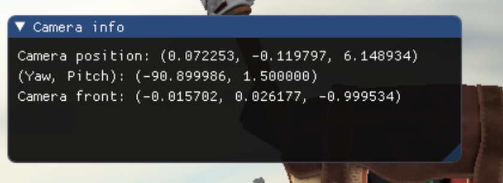

# matf-rg-project

`matf-rg-project` is the base project for the Computer Graphics course at the Faculty of Mathematics,
University of Belgrade for the school year of 2024/2025.

# Setup

## Linux

### Debian based (Ubuntu, Debian...)

**To setup the necessary libraries, run:**  
`./setup.sh`

**To generate docs, run:**  
`doxygen Doxyfile`   
Open the documentation file in your browser: `docs/html/index.html`

# Engine

## Main loop

```cpp
class App {
public:
int run(int argc, char** argv) {
  try {
    engine_setup(argc, argv);
    app_setup();
    initialize();
    while (loop()) {
        poll_events();
        update();
        draw();
    }
    terminate();
  } catch(...) { ... }
  return on_exit();
}
};
```

* `engine_setup` - here, the engine controllers are setup
* `app_setup` - the function that the user of the `App` overrides and implements a custom setup for the App
* `initialize` - `App` should gather whatever `Resources` it needs and initialize its state.
* `loop` - `App` can check whether it should continue running. If the `loop` method returns `false`,
  the `Main loop` stops, and the `App` terminates.
* `poll_events` - `App` collects information about the events that happened at the `Platform` and collects user input
  for the upcoming frame.
* `update` - `App` updates the world state, processes physics, events, and world logic, and reacts to the user inputs.
* `draw` - `App` uses `OpenGL` and draws the current state of the world.
* `terminate` - `App` terminates its state
* `on_exit` - do a final cleanup, and return an exit code

## The App class

Here is the interface of the `engine/core/App.hpp` class:

```cpp
class App {
    public:
        int run(int argc, char **argv);
        virtual ~App() = default;
    private:
        void engine_setup(int argc, char **argv);
        void initialize();
        void poll_events();
        bool loop();
        void update();
        void draw();
        void terminate();
        virtual void app_setup() { // the user extends and implements setup }
        virtual int on_exit() { return 0; }
        virtual void handle_error(const Error &);
    };
```

## Project structure

Here is how the `Engine` is structured. You only need to include `<engine/core/Engine.hpp>` in your part of the project
and all the header files will be available.

```bash
├── core
│   ├── App.hpp
│   ├── Controller.hpp
│   └── Engine.hpp
├── graphics
│   ├── Camera.hpp
│   ├── GraphicsController.hpp
│   └── OpenGL.hpp
├── platform
│   ├── Input.hpp
│   ├── PlatformController.hpp
│   ├── PlatformEventObserver.hpp
│   └── Window.hpp
├── resources
│   ├── Mesh.hpp
│   ├── Model.hpp
│   ├── ResourcesController.hpp
│   ├── ShaderCompiler.hpp
│   ├── Shader.hpp
│   ├── Skybox.hpp
│   └── Texture.hpp
└── util
    ├── ArgParser.hpp
    ├── Configuration.hpp
    ├── Errors.hpp
    └── Utils.hpp
p
```

## How ...

### How to set up a basic app?

For a basic app setup, you need to:

1. Create a class for your App, let's call it `MyApp`, in the `app/src/`.
2. Inherit from the `engine::core::App` and implement `app_setup()`.
3. Instantiate `MyApp` object in the `main` function and call `run` on it.
4. Compile and run the program.

```cpp
#include <engine/Engne.hpp>
class MyApp : public engine::core::App {

public:
  void setup() override;
};

void MyApp::user_setup() {
    spdlog::info("Hello, setup!");
}

int main(int argc, char** argv) {
    return std::make_unique<MyApp>()->run(argc, argv);
}
```

### How to add a custom controller?

`Controllers` are a way to hook into the engine execution. To create a custom controller:

1. Create a custom controller class that extends the `engine::core::Controller`
2. Implement for the phase (`initialize`, `loop`, `poll_events`, `update`, `begin_draw`, `draw`, `end_draw`,
   `terminate`) for which you want to
   execute custom code.
3. Register the controller in the `MainApp::user_setup`.

Here is the example of creating the `MainController` that enables `depth testing`.

```cpp
class MainController : public engine::core::Controller {
protected:
    void initialize() override {
        engine::graphics::OpenGL::enable_depth_testing();
    }
};
class MainApp final : public engine::core::App {
protected:
    void app_setup() override {
        auto main_controller = engine::controller::register_controller<MainController>();
        /* Make sure that the main_controller executes after all the engine controllers. */
        main_controller->after(engine::core::Controller::get<engine::core::EngineControllersEnd>());
    }
};

```

### How does the engine manage resources?

Resources currently include: `textures`, `shaders`, `models`, `skyboxes`.
The `ResourcesController` manages the loading, storing, and accessing the resource objects.
During the `App::initialize`, the `ResourcesController` will load all the resources in the `resources` directory.

For every type of resource, the `ResourcesController` has a corresponding function that retrieves it:

* `Model* ResourcesController::model("backpack")`
* `Shader* ResourcesController::shader("basic")`
* `Texture* ResourcesController::texture("awesomeface")`
* `Skybox* ResourcesController::skybox("skybox")`

The argument is always the resource name without the file extension. For textures and shaders, the name is just the name
of
the file without the extension. For models and skyboxes, it's the name of the directory, because they have multiple
files
associated with them.

The pointer to the `resource` that the `ResourcesController` returns is a *non-owning pointer*, meaning you should
**never call delete on it.** All the memory is managed internally by the `ResourcesController.`

### How to add a model?

The `resources/models/` directory stores all the models. Let's add a backpack model from the course.

1. Create a directory, `resources/models/backpack.`
2. Copy the `backpack` model files into the `resources/models/backpack`.
3. Add a configuration for your model in the config.json

```
 "resources": {
    "models": {
      "backpack": { # <--- This will be the name of the model you use in the app
        "path": "backpack/backpack.obj", # <---- Relative path to the .obj file
        "flip_uvs": false # <---- whether the loader should flip the texture coordinates
      }
    }
  }
```

4. The `ResourcesController` will automatically load this model during `ResourcesController::initialize()`; you should
   see a log:

```
...
[2024-12-08 11:19:12.347] [info] load_model(backpack, resources/models/backpack/backpack.obj)
[2024-12-08 11:19:13.272] [info] Loading texture: resources/models/backpack/diffuse.jpg
[2024-12-08 11:19:14.114] [info] Loading texture: resources/models/backpack/specular.jpg
[2024-12-08 11:19:14.479] [info] Loading texture: resources/models/backpack/normal.png
...
```

5. Use the model in your App:

```cpp
    Model* backpack = engine::core::Controller::get<engine::resources::ResourcesController>()->model("backpack");
    Shader* shader   = ... 
    backpack->draw(shader);
```

### How to add a texture?

1. Add a texture file `awesomeface.png` to the `resources/textures` directory
2. Use it in the App (`ResourcesController` will automatically load it)

```cpp
Texture* texture = engine::core::Controller::get<ResourcesController>()->texture("awesomeface");
```

### How to add a shader?

1. Create a `your_shader.glsl` in the `resources/shaders/your_shader.glsl`.
2. Implement `vertex`, `fragment`, and `geometry` (optional), shaders in the same file.
3. Use it in the App:

```cpp
Shader* shader = engine::core::Controller::get<ResourcesController>()->shader("your_shader");
Model* backpack = ...;
backpack->draw(shader);
```

Vertex, fragment, and geometry shaders are written in the same file.
Use the `// #shader vertex|fragment|geometry` to declare the start of the shader.
Here is an example:

```glsl
//#shader vertex
#version 330 core
layout (location = 0) in vec3 aPos;

void main() {
    gl_Position = vec4(aPos, 1.0);
}

//#shader fragment
#version 330 core

out vec4 FragColor;

void main() {
    FragColor = vec4(0.0, 0.0, 0.0, 1.0);
}
```

`ResourcesController` will load and compile all the shaders in the `resources/shaders` directory.

### How to draw a GUI?

`Engine` uses the [imgui](https://github.com/ocornut/imgui) library to draw a GUI. See the library page for more
examples.
For GUI to be visible it should be drawn last, after all the world objects.
Here is an example of displaying camera info in a GUI.

```cpp
    auto graphics = engine::core::Controller::get<engine::graphics::GraphicsController>();
    graphics->begin_gui();
    // Draw Camera Info window
    {
        ImGui::Begin("Camera info");
        const auto &c = *camera;
        ImGui::Text("Camera position: (%f, %f, %f)", c.Position.x, c.Position.y, c.Position.z);
        ImGui::Text("(Yaw, Pitch): (%f, %f)", c.Yaw, c.Pitch);
        ImGui::Text("Camera front: (%f, %f, %f)", c.Front.x, c.Front.y, c.Front.z);
        ImGui::End();
    }
    graphics->end_gui();
```



### How to throw and handle errors?

The `Engine` defines a base `Error` type with two subclasses, `EngineError` and `UserError`. They serve
as a *graceful* way to terminate the application and provide the user with some helpful information on how to **fix**
the
error.

For example, the `ResourcesController` will throw `AssetLoadingError` if it can't read the asset file.

```cpp
if (!scene || scene->mFlags & AI_SCENE_FLAGS_INCOMPLETE || !scene->mRootNode) {
    throw util::EngineError(util::EngineError::Type::AssetLoadingError,
                            std::format("Assimp error while reading model: {} from path {}.",
                                        model_path.string(), name));
}
```

`Exceptions` shouldn't be used as a control-flow mechanism, instead they should be used to inform the user of an
`exceptional` event that
the program can't do anything about, like the missing asset file.

### How to get the key/mouse press event?

The `PlatformController` differentiates between four types of button/key states:

1. `engine::platform::Key::State::JustPressed` -> Only in the first frame when the button was registered as pressed
2. `engine::platform::Key::State::Pressed` -> Every subsequent frame if the button is still held
3. `engine::platform::Key::State::JustReleased` -> Just the first frame in which the button was registered as released
4. `engine::platform::Key::State::Released` -> Button is not pressed

Use the `PlatformController::key` method to get the state of the key in a given frame:

Here is an example of turning GUI on/off drawing using the `F2` key:

```cpp
void poll_events() override {
    const auto platform = engine::core::Controller::get<engine::platform::PlatformController>();
    if (platform->key(engine::platform::KeyId::KEY_F2).state() == engine::platform::Key::State::JustPressed) {
        m_draw_gui = !m_draw_gui;
    }
}
```

Keys have a unique identifier: via `engine::platform::KeyId`.

### How to register a callback for platform events?

1. Implement the event observer by extending the class `engine::platform::PlatformEventObserver`, and override methods
   you'd
   like to have a custom operation executed once the event happens
2. Register the `observer` instance in the `PlatformController`.

```cpp
class MainPlatformEventObserver final : public engine::platform::PlatformEventObserver {
public:
    void on_keyboard(engine::platform::Key key) override {
        spdlog::info("Keyboard event: key={}, state={}", key.name(), key.state_str());
    }
};
class MainController : public engine::core::Controller {
protected:
    void initialize() override {
        // ... 
        auto observer = std::make_unique<MainPlatformEventObserver>();
        engine::core::Controller::get<engine::platform::PlatformController>()->register_platform_event_observer(std::move(observer));
    }
    // ...
}
```

Now, for every keyboard event, the `PlatformController` will call `MainPlatformEventObserver::on_keyboard` and pass
the `key` on which the event occurred as an argument.

### How to get Window properties?

`PlatformController` initializes and stores the `Window` handle, which you can access via:

```cpp
    auto platform = engine::core::Controller::get<engine::platform::PlatformController>();
    platform->window()->height()
    platform->window()->width()
    platform->window()->title()
```

Also, the `PlatformController` will update the window properties if the size of the window changes.

### How to add new OpenGL calls?

Rendering actions that require more than one OpenGL call should be abstracted in the `engine::graphics::OpenGL` class.
For example, `OpenGL::compile_shaer` compiles a GLSL shader and returns the shader_id.

```cpp
uint32_t OpenGL::compile_shader(const std::string &shader_source,
                                resources::ShaderType shader_type) {
    uint32_t shader_id             = CHECKED_GL_CALL(glCreateShader, shader_type_to_opengl_type(shader_type));
    const char *shader_source_cstr = shader_source.c_str();
    CHECKED_GL_CALL(glShaderSource, shader_id, 1, &shader_source_cstr, nullptr);
    CHECKED_GL_CALL(glCompileShader, shader_id);
    return shader_id;
}
```

If the OpenGL call fails, the `CHECKED_GL_CALL` macro throws an `OpenGLError` in DEBUG mode. The engine will print the
error description of
and the source location in which it occurred.

Why this way? It's less error-prone and more straightforward to add debugging assertions and error checks if needed.

### How do you add a configuration option?

You can configure some parts of the `engine` in the `config.json`. For example, we can
configure the size and the title of the window when the application starts.

```json
{
  "window": {
    "height": 600,
    "title": "Hello, window!",
    "width": 800
  }
}
```

You can also add your custom configuration options:

```json
{
  "exposure": 2.45,
  "on_exit_message": "Bye..."
}
```

and use them:

```cpp
auto &config = util::Configuration::config();
float exposure = config["exposure"].get<float>();
std::string gamma = config["on_exit_message"].get<std::string>();
```

The `Configuration` class uses [nlohmann/json](https://github.com/nlohmann/json) library to load and store `json` files,
see
the library page for documentation.

### How to pass a command line argument?

You use the `ArgParser` to parse the command line arguments anywhere from the program.
For example, for the invocation command: `./matf-rg-engine ... --fps 120`, the
`parser->arg("--fps")` will return the value 60. If the argument is not present, it will return the default value
passed as the second argument to the `arg` method.

```cpp

void setup() override {
    auto parser = engine::util::ArgParser()->instance();
    auto fps = parser->arg<int>("--fps", 60);
}
```

# Tutorials

## App test tutorial

Here you can find a walkthrough [tutorial](engine/test/app/TUTORIAL.md) for recreating the `engine/test/app` that
demonstrates how to use different engine systems.
